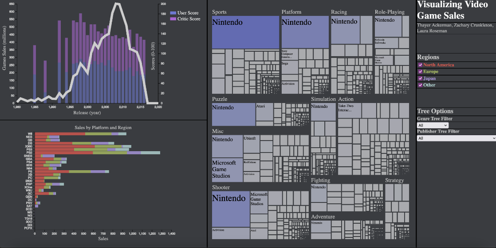

# Video Game Sales Visualization
An interactive JavaScript visualization of Video Games Sales

<br>

VideoGameSales is an interactive, data web visualization of video game sales from 1980 to 2016 written in JavaScript, HTML, and CSS. This web application allows the user to interact with the dataset to answer questions about video game popularity by region, the relationship between sales and reviews, video game sales trends over time, and much, much more.

<br>

---
---

<br>

## Contents

- [About the Project](#about-the-project)
    - [The Dataset](#the-dataset)
    - [Analysis Questions](#analysis-questions)
    - [Learning Objectives](#learning-objectives)
- [Using the Visualization](#using-the-visualization)
    - [Installation](#installation)
    - [Running](#running)
    - [Interface](#interface)
- [Acknowledgments](#acknowledgments)

<br>

---
---

<br>

## About the Project

### The Dataset

The Video Game Sales project visualizes data from the [Video Game Sales](https://www.kaggle.com/datasets/gregorut/videogamesales) dataset, obtained from kaggle. 

This dataset contains a list of video games with sales greater than 100,000 copies. It was generated by a scrape of vgchartz.com.

Fields include:
- Rank - Ranking of overall sales
- Name - The games name
- Platform - Platform of the games release (i.e. PC,PS4, etc.)
- Year - Year of the game's release
- Genre - Genre of the game
- Publisher - Publisher of the game
- NA_Sales - Sales in North America (in millions)
- EU_Sales - Sales in Europe (in millions)
- JP_Sales - Sales in Japan (in millions)
- Other_Sales - Sales in the rest of the world (in millions)
- Global_Sales - Total worldwide sales.


### Analysis Questions

The visualization was created to help answer the following analysis questions among many others:

&nbsp;&nbsp;&nbsp;&nbsp;&nbsp;&nbsp;&nbsp;&nbsp;*What genres and publishers are most popular in North America?*

&nbsp;&nbsp;&nbsp;&nbsp;&nbsp;&nbsp;&nbsp;&nbsp;*Is there a trend to be found in video game sales throughout the years?*

&nbsp;&nbsp;&nbsp;&nbsp;&nbsp;&nbsp;&nbsp;&nbsp;*What platforms have the most sales and in which regions (either NA, EU, or JP)?*

&nbsp;&nbsp;&nbsp;&nbsp;&nbsp;&nbsp;&nbsp;&nbsp;*Is there a relationship between the global sales of video games and both the critic scores and the user scores?*


### Learning Objectives

*This application was designed as a final project for the Visual Analytics class at Appalachian State University.*

*In addition to helping analyze video game sales, this project was designed to facilitate in better learning JavaScript, D3, and, most importantly, the principles of data visualization.*

<br>

---
---

<br>

## Using the Visualization

### Installation
Upon [installing git](https://git-scm.com/book/en/v2/Getting-Started-Installing-Git), this public repository can be cloned using the following command:

```
git clone https://github.com/ThayerAckerman/VideoGameSales.git
```

If you wish to [fork](https://docs.github.com/en/pull-requests/collaborating-with-pull-requests/working-with-forks/fork-a-repo) the repository, make sure you create a new fork before before cloning.

### Running
To run the visualization app in a browser of your choosing, a server is needed to serve the local files. One way to run a simple local server is to use [Python's built-in http server](https://docs.python.org/3/library/http.server.html#module-http.server). After downloading the project, avigate to its directory and run the following command:
```
python -m http.server 8000
``` 
The number 8000 represents the port number. This can be changed to any valid port number that is not in use.

Now that the server is live, you can use the application by opening the following URL in a browser of your choosing:
```
http://localhost:8000
```
Make sure to close the Python server when you are done using the app. One way to do this is to press ```Ctrl+C``` in the terminal where the server was started.

### Interface
The visualization app is seperated into 4 distinct panes – the line plot, stacked bar chart, treemap diagram, and  filter options pane – as shown below:


In addition to each of the four panes, all visualizations also support basic hover interactions, enabling the user to learn more about each data point by simpling hovering over them.

**1. Line / Bar Plot**

This pane, located in the top, left corner, displays game sales over time with the user and critic ratings, per year, overlayed. In addition to providing a simple view of sales over time, it also allows the user to easily monitor the relationships between game sales and ratings.

**2. Stacked Bar Plot**

The second pane, located in the bottom, left corner, shows a stacked bar chart of game sales by platform, with the regions stacked. This makes it easy to compare sales between platforms, taking into account each region. 

**3. Tree Map**

Next is the tree map pane, in the right, center of the window. The final visualization is the tree map. This tree map shows the sales of each publisher within specific genres through the sizes of nested rectangles. By visualizing sales through the area of rectangles, the user is provided with a better intuition for analysis.

**4. Filter Options**

Finally, the filter options pane is on the far right of the window. This pane contains the title, contributors, and filters for the region and tree. The region filter is color-coded across the visualization and allows for any combination of regions to be compared. The tree options section of this pane allows the tree map to be filtered by genre and publisher.


<br>

---
---

<br>

## Acknowledgments
The VideoGameSales visualization app was created by [Thayer H. Ackerman](https://github.com/ThayerAckerman), Zachary Crunkleton, and Laura Roseman.

Special thanks to Dr. Tinghao Feng for his help learning JavaScript and data visualization.
